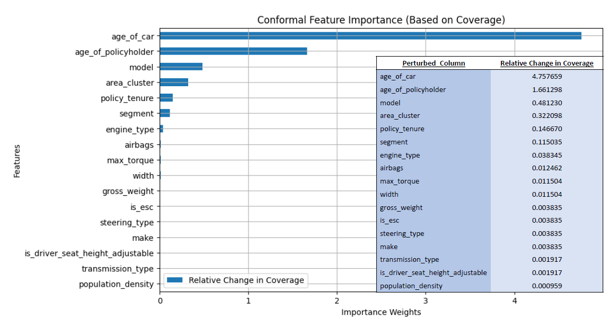
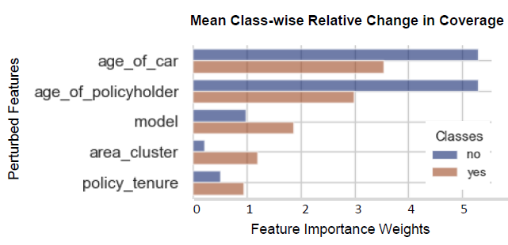

# ConformaSight Global Explainer Package 📦


### Introduction

ConformaSight is produced as a global and model-agnostic explainer to AI model. Conformal prediction has emerged as a straightforward approach to establish statistically robust uncertainty intervals for predictions generated by black-box machine learning models employed in critical scenarios. The use of conformal prediction with a user-defined probability threshold ensures that the resulting sets reliably contain the ground truth, independent of any assumptions regarding the data distribution. While these models offer transparency in terms of uncertainty quantification, they often lack explainability when it comes to understanding the factors driving changes in conformal metrics such as coverage, set size, and thus the formation of prediction sets. Our paper introduces a comprehensive global explainability framework based on conformal prediction, addressing the void of accommodating prediction set-type outputs in various classifiers. This understanding not only enhances transparency but also ensures verifiability in understanding the factors driving changes in conformal metrics and the formation of prediction sets which are guaranteed to have ground truth with the help of counterfactual instances of calibration-sets. Moreover, ConformaSight’s capability to capture and rank significant features, boosting classifier coverage, enables it to effectively identify the minimal dataset required for optimal model performance. We also showcase the flexibility of employing user-defined thresholds and re-calibration techniques to generate robust and reliable global feature importance estimates on test sets with significantly different distributions, obtained by perturbing the original test sets.


### Features

Presented herein is ConformaSight, our proposed framework rooted in conformal prediction methodology. It is designed to furnish robust and insightful explanations independent of the data distribution, produce explanations for set-type outputs by the conformal predictors. Unlike traditional methods where explanations focus solely on feature importance, explanations in conformal prediction-based models consider how the calibration process influences the prediction outcomes. For instance, if a particular feature in the calibration set has a strong influence on the coverage of prediction intervals, it indicates that this feature plays a crucial role in determining the model’s confidence in its predictions. Therefore, explaining the model’s predictions involves not only highlighting the importance of features but also elucidating how the calibration process impacts the prediction outcomes.

```python
type_of_metric = ['coverage','set_size','pred_set']
# we enable user to pick one parameter to calculate feature importance
noise_type = ['gaussian', 'uniform']
# we anbale user to pick one perturbation type to perturb calibration set

# user can call the plot_conformal_explainer in 3 x 2 in total 6 different combinations.
# the following call plots feature importance referencing the relative change in coverage with gaussian perturbation in calibration set
plot_conformal_explainer(model_base, X_Cal, y_cal, X_test, y_test, alpha, class_labels, type_of_metric[0], noise_type[0]) 
```
Then the code will plot the following bar graph showing which are the most significant features that led change in coverage.



```python
# the following call plots feature importance referencing the relative change in coverage with gaussian perturbation in calibration set
plot_conformal_explainer(model_base, X_Cal, y_cal, X_test, y_test, alpha, class_labels, type_of_metric[3], noise_type[1]) 
```
The code will plot the following bar graph which compares the change in coverage per class.



### Installation

<b> Technology Used: </b> Python <br/>
<b> Dependencies: </b> Please check <ins>requirements.txt</ins> file in documentation. <br/>

### Usage

You should divide your data as follows to use the ConformaSight, <br/>

```python
y = df['target']
X = df.drop(['target'], axis=1)
# Split the dataset into training and testing sets
X_train, X_test, y_train, y_test = train_test_split(X, y, test_size=0.5, random_state=42, stratify=y)
X_Cal, X_test,  y_cal, y_test = train_test_split(X_test, y_test, test_size=0.5, random_state=42, stratify=y_test)  
```
We developed a straightforward method called plot conformal explainer, which accepts several parameters. These parameters include α, as defined in Equation 1 in the paper provided, X Cal, y cal, X test, and y test. Additionally, the method takes the noise type parameter, which can be either “gaussian” or “uniform”, and the type of metric parameter, which can take on values such as “coverage”, “set size”, or “pred set”. If the type of metric is specified as “coverage”, the method calculates relative changes based on the coverage metric.

```python
type_of_metric = 'coverage'
noise_type = 'gaussian'
alpha = 0.05
plot_conformal_explainer(model_base, X_Cal, y_cal, X_test, y_test, alpha, class_labels, type_of_metric, noise_type) 
```

### Contributing

The code is produced by the fund provided by the University of Bologna.

<b>Authors<b/> <br/>
Fatima Rabia Yapicioglu <br/>
Alessandra Stramiglio


### Licenses 

[](https://www.apache.org/licenses/LICENSE-2.0)
[](https://opensource.org/licenses/BSD-3-Clause)


